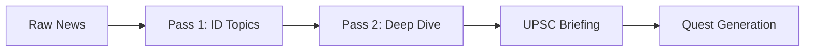

<div align="center">

# 🏛️ CivilMind AI
### *The Autonomous Agent for UPSC Excellence*

[](https://python.org)
[](https://streamlit.io)
[](https://deepmind.google/technologies/gemini/)

**CivilMind AI** is a premium, purpose-built AI agent designed to help UPSC (Union Public Service Commission) aspirants master Current Affairs through autonomous reasoning and active recall.

[✨ Features](#-features) • [🧠 Agentic Core](#-agentic-core) • [🚀 Quick Start](#-quick-start) • [📂 Structure](#-structure)

---


*A high-performance "Bureaucratic Gold" interface designed for long-form study.*

</div>

## ✨ Features

- **📰 Intelligent Daily Briefing**: Autonomous analysis of real-time news from PIB and National Dailies, mapped directly to GS I, II, III, and IV papers.
- **⚔️ Interactive Quest Mode**: Structured MCQs with a "Deferred Reveal" system. Includes specific **Strategic Approaches** for every question to sharpen elimination techniques.
- **🧭 Strategy Advisor**: A dedicated mentorship console for preparation planning, resource management, and answer-writing tips.
- **🔍 Temporal Filtering**: The "Eyes" of the agent (`news_fetcher.py`) strictly focus on the last 48 hours to ensure relevance.
- **🎨 Premium UX**: A high-contrast, academic design system optimized for accessibility and focus.

---

## 🧠 The Agentic Core: Recursive Reasoning

Unlike standard chatbots, CivilMind AI operates on a **Recursive Reasoning Loop (Two-Pass Analysis)**:

1.  **SENSE**: The `NewsFetcher` pulls raw data from government and news RSS feeds.
2.  **REASON (Pass 1)**: The agent identifies the TOP 2 most critical topics for the UPSC Mains exam.
3.  **RESEARCH (Pass 2)**: The agent performs a deep-dive analysis focusing specifically on those critical areas.
4.  **ACT**: The agent synthesizes a multi-dimensional briefing including Facts, Context, and a "Mains Perspective."



---

## 🚀 Quick Start

### 1. Prerequisites
Ensure you have Python 3.14+ installed.

### 2. Installation
```bash
# Clone the repository
git clone https://github.com/Anirudh9810/CivilMind-AI.git
cd CivilMind-AI

# Install dependencies
pip install -r requirements.txt
```

### 3. Configuration
Create a `.env` file in the root directory:
```env
GOOGLE_API_KEY=your_gemini_api_key_here
```

### 4. Launch
```bash
streamlit run main.py
```

---

## 📂 Project Structure

- `main.py`: The UI Orchestrator and State Machine.
- `agent.py`: The "Brain" containing the Recursive Reasoning logic.
- `news_fetcher.py`: The "Eyes" for real-time news acquisition and temporal filtering.
- `style_utils.py`: Design tokens and premium CSS injection.

---

<div align="center">
Built with ❤️ for UPSC Aspirants.
<br>
<i>"The Indian Constitution is a living document; your preparation should be too."</i>
</div>

# youtube link - https://youtu.be/Uop1eN_u_oM